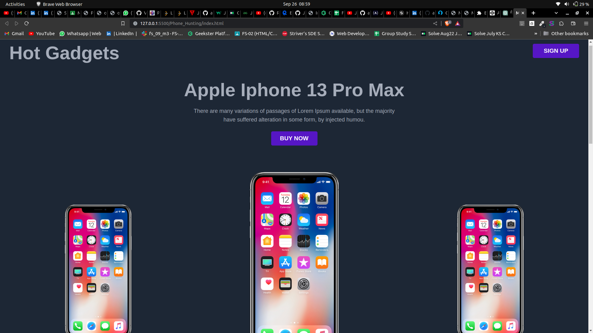
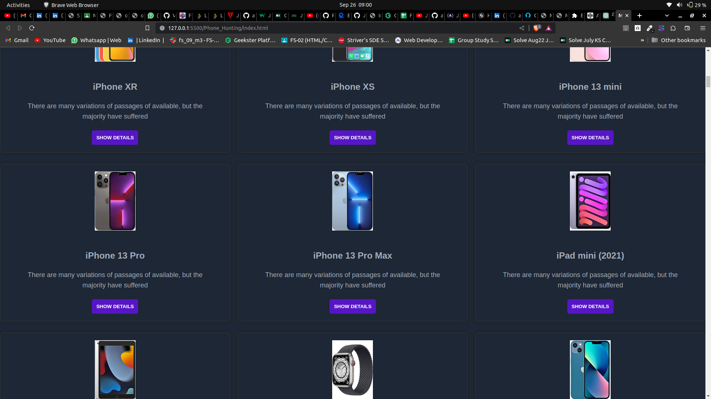
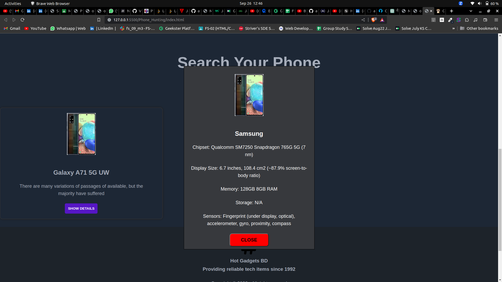

# Mobile Hunting

Mobile Hunting is a web application for exploring and finding information about various mobile phones. It allows users to search for mobile phones by brand, model, and more.

## Table of Contents

- [Features](#features)
- [Screenshots](#screenshots)
- [Getting Started](#getting-started)
- [Usage](#usage)
- [API](#api)
- [Contributing](#contributing)
- [Code](#Code)

## Features

- View a list of mobile phones.
- Search for mobile phones by brand, model, etc.
- View detailed information about a specific mobile phone.
- 

## Screenshots

## Getting Started

To get started with the project, follow these steps:

1. Clone this repository.
2. Open `index.html` in a web browser.

## Usage

- Enter a keyword in the search box to find mobile phones.
- Click on "SHOW DETAILS" to view detailed information about a mobile phone.

## API

This project uses the [Programming Hero API](https://openapi.programming-hero.com/api/phones) to fetch mobile phone data.

## Contributing

If you'd like to contribute to this project, please follow these guidelines:

1. Fork the repository.
2. Create a new branch.
3. Make your changes and commit them.
4. Push to your fork and submit a pull request.

## Code

- javascript->

let search = "11";
let inputSearch = document.getElementById("inputSearch");
let valueInput = inputSearch.value;
// const api_url = `https://openapi.programming-hero.com/api/phones?search=${search}`;

window.addEventListener("load", async function () {
  try {
    let response = await callApi(search);
    console.log(response);
    let getClass = document.querySelector(".mobileList");
    for (let i = 0; i < response.length; i++) {
      let ele = createElement(
        response[i].image,
        response[i].phone_name,
        "",
        response[i].slug
      );
      getClass.appendChild(ele);
      console.log(ele);
    }

    // console.log(getClass);
  } catch (err) {
    console.log(err);
  }
});
async function searchPhone() {
  // search = "";
  let getClass = document.querySelector(".mobileList");

  // Remove all child elements (previous search results)
  while (getClass.firstChild) {
    getClass.removeChild(getClass.firstChild);
  }

  console.log(getClass);

  let phoneValue = document.getElementById("inputSearch");
  console.log(phoneValue.value);
  let response = await callApi(phoneValue.value);

  for (let i = 0; i < response.length; i++) {
    let ele = createElement(
      response[i].image,
      response[i].phone_name,
      "",
      response[i].slug
    );
    getClass.appendChild(ele);
    console.log(ele);
  }
}

async function callApi(searchValue) {
  const api_url = `https://openapi.programming-hero.com/api/phones?search=${searchValue}`;
  let apiSearch = await fetch(api_url);
  let response = await apiSearch.json();
  return response.data;
}
function createElement(img_Url, phoneName, desc, slug) {
  let div = document.createElement("div");
  div.innerHTML = `
         

         
         <h2>${phoneName}</h2>
         

           There are many variations of passages of available, but the  
           majority have suffered
         

 
         

           <button class="btn" id="btn" onclick=showDetails('${slug}')>SHOW DETAILS</button>
         

       
 `;

  return div;
}
async function callModel(id) {
  const api_url = ` https://openapi.programming-hero.com/api/phone/${id}`;
  let apiSearch = await fetch(api_url);
  let response = await apiSearch.json();
  return response.data;
  // console.log(response.data);
}

//----show details----
async function showDetails(slug) {
  // Fetch mobile phone details based on the slug
  let response = await callModel(slug);

  // Check if the API response contains the necessary properties
  if (response) {
    // Access the properties and store them in variables
    let brand = response.brand || "N/A"; // Default value if brand is missing
    let image = response.image || ""; // Default value if image URL is missing
    let mainFeatures = response.mainFeatures || {};
    let chipSet = mainFeatures.chipSet || "N/A";
    let displaySize = mainFeatures.displaySize || "N/A";
    let memory = mainFeatures.memory || "N/A";
    let sensors = mainFeatures.sensors || [];
    let storage = response.storage || "N/A";

    // Create a modal container
    let modal = document.createElement("div");
    modal.className = "modal";

    // Set the content of the modal
    modal.innerHTML = `
      

      
        
        <h2>${brand}</h2>
        
Chipset: ${chipSet}

        
Display Size: ${displaySize}

        
Memory: ${memory}

        
Storage: ${storage}

        
Sensors: ${sensors.join(", ")}

        <button onclick=closeTab()>CLOSE</button>
      

    `;

    // Append the modal to the body
    document.body.appendChild(modal);
  } else {
    // Handle the case where the response is missing or undefined
    console.log("Phone details not available");
  }
}

function closeTab() {
  // Find and remove the modal
  let modal = document.querySelector(".modal");
  if (modal) {
    modal.parentNode.removeChild(modal);
  }
}

- HTML->

<!DOCTYPE html>
<html lang="en">
  <head>
    <meta charset="UTF-8" />
    <meta name="viewport" content="width=device-width, initial-scale=1.0" />
    <title>Mobile Hunting</title>
    <link rel="stylesheet" href="style.css" />
  </head>
  <body>
    <!-- ------navBar------- -->
    

      

        <h1>Hot Gadgets</h1>
      

      

        <button class="btn btn-large">SIGN UP</button>
      

    

    <!-------Second Div--------->
    

      

        <h1>Apple Iphone 13 Pro Max</h1>
        

          There are many variations of passages of Lorem Ipsum available, but
          the majority  
          have suffered alteration in some form, by injected humou.
        

        

          <button class="btn btn-large" class="centerItem">BUY NOW</button>
        

      

    

    <!-- ------PhoneADD-Apple----- -->
    

      

        
      

      

        
      

      

        
      

    

    <!-- -----phoneSearch---- -->

    

      <h1>Search Your Phone</h1>
      

        <input
          type="text"
          name=""
          id="inputSearch"
          placeholder="e.g. oppo, samsung, iphone"
        />
        <button class="btn btn-large" type="submit" onclick=searchPhone();>Search</button>
      

    

    <!-- ----Mobile list section__ -->
    

      <!-- -----1------ -->
      <!-- 

        
        <h2>Find X5</h2>
        

          There are many variations of passages of available, but the  
          majority have suffered
        

        

          <button class="btn" id="btn" type="submit">SHOW DETAILS</button>
        

      
 -->
     
      
 -->
    

    <!-- 

      <button class="btn" id="btn" onclick="showAll()">SHOW ALL</button>
    
 -->
    <!------footer------- -->
    

      

        

        
    

        <h3 >Hot Gadgets BD  
             Providing reliable tech items since 1992</h3>
        
Copyright © 2023 - All right reserved 

        
Created By ASGAR 🍀  

        

          
       
        

      

    

    
  </body>
</html>

